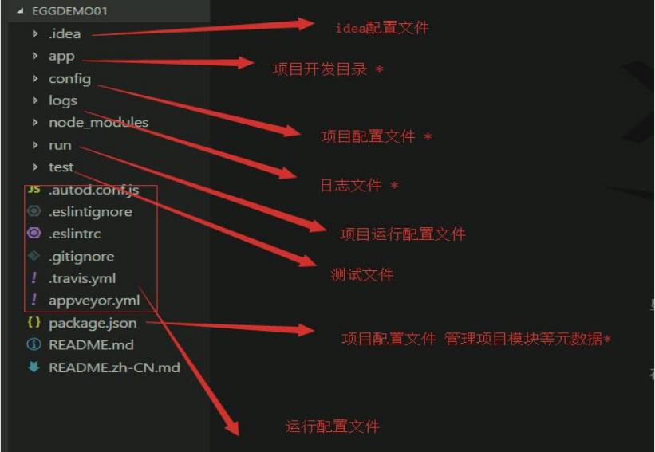
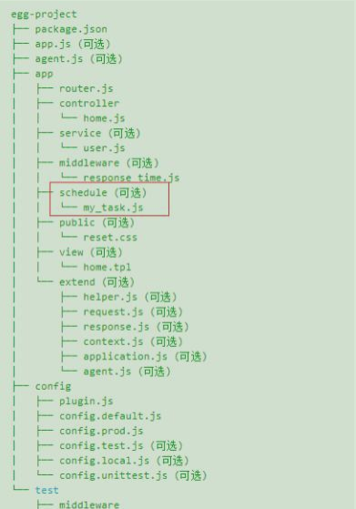
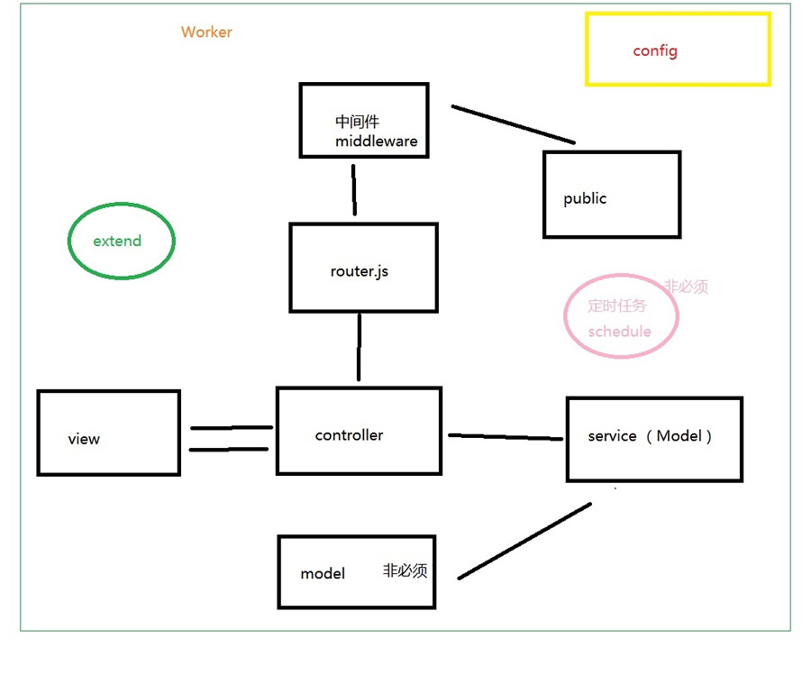
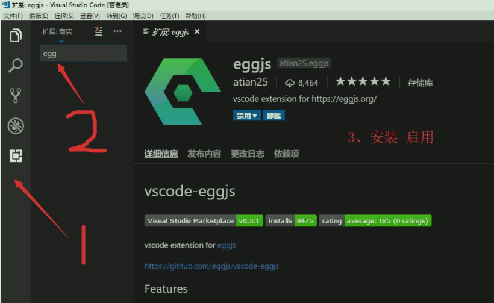

# EggJS基本使用

::: tip 记录
记录一下自己学习过程，方便以后自己查阅
:::

[[toc]]
### Egg.js官网

官网： https://eggjs.org

中文网站: https://eggjs.org/zh-cn/

### Egg.js  是什么?
Egg.js 是《阿里旗下产品》基于 Node.js 和 Koa 是一个 Nodejs 的企业级应用开发框架。
可以帮助发团队和开发人员降低开发和维护成本。
Express 和 Koa 是 Node.js 社区广泛使用的框架，简单且扩展性强，非常适合做个人项
目。但框架本身缺少约定，标准的 MVC 模型会有各种千奇百怪的写法。Egg 按照约定进行
开发，奉行『约定优于配置』，团队协作成本低。
Egg.js 基于 Es6、Es7 以及 Typescript、Koa2 使得 Nodejs 具有更规范的开发模式、更低
的学习成本、更优雅的代码、更少的开发成本、更少的维护成本。

### Egg.js  的特性：
1. 提供基于 Egg 定制上层框架的能力
2. 高度可扩展的插件机制
3. 内置多进程管理
4. 基于 Koa 开发，性能优异
5. 框架稳定，测试覆盖率高
6. 渐进式开发

### Egg.js  在阿里的地位


### Egg.js发展历程

1. 2013 年蚂蚁的 chair 框架，可以视为 egg 的前身。
2. 2015 年 11 月，在苏千的召集下，阿里各 BU 的前端骨干齐聚黄龙，闭门共建。
3. 2016 年初，各 BU 的基础 web 框架完成升级，在同一套规范的基础上进行差异化定制。
4. 2016 年中，广泛使用在绝大部分阿里的前端 Node.js 应用。
5. 2016 年 09 月，在 JSConf China 2016 上亮相并宣布开源。
6. 2017 年初，官网文档 egg - 为企业级框架和应用而生 亮相，并将在本月发布 egg@1.0版本。
7. 2017 年 12 月左右 Egg 社区版 2.0 正式发布，性能提升 30%，基于 koa2 拥抱 Async
8. 2018 年 7 月最新 egg 的版本是 2.2.1

经过几年的沉淀 Egg 已经非常成熟。

### Egg.js  目录结构介绍


### Egg.js目录约定规范


egg工作流



### Vscode+Egg  开发工具配置


### Egg 路由配置

https://eggjs.org/zh-cn/basics/router.html

### 取获取 Get  传值以及动态路由的值

https://eggjs.org/zh-cn/basics/controller.html

### egg-view-ejs  的使用

https://github.com/eggjs/egg-view-ejs

1. 安装
```js
npm i egg-view-ejs --save
```

2. 找到 {app_root}/config/plugin.js

```js
exports.ejs = {
  enable: true,
  package: 'egg-view-ejs',
}
```

3. 找到 {app_root}/config/config.default.js

```js
module.exports = appInfo => {
  const config = exports = {}
  // use for cookie sign key, should change to your own and keep security
  config.keys = appInfo.name + '_1532498393023_7447'
  // add your config here
  config.middleware = []
  //配置 ejs 模板引擎
  config.view = {
    mapping: {
    '.html': 'ejs'
    }
  }
  return config
}
```

### 服务(service)和控制器(controller)相互调用规则


### Egg 制 安全机制 CSRF  的防范

[https://eggjs.org/zh-cn/core/security.html](https://eggjs.org/zh-cn/core/security.html)

### Egg Post  提交数据

> 第一种post提交数据

```js
<form action="/news/doAdd?_csrf=<%=csrf%> " method="POST">
  用户名: <input type="text" name="username" /> <br><br>
  密 码: <input type="text" name="password" type="password" />
  <button type="submit">提交</button>
</form>
```

> 第二种post提交数据

```js
<form action="/news/doAdd" method="POST">
  <input type="hidden" name="_csrf" value="<%=csrf%>">
  用户名: <input type="text" name="username" /> <br><br>
  密 码: <input type="text" name="password" type="password" />
  <button type="submit">提交</button>
</form>
```

### 获取数据(egg.js 获取数据不需要配置中间件直接通过下面方式获取)
```js
this.ctx.request.body
```

### 获取 csrf
```js
this.ctx.csrf
```

### Egg  配置模板全局变量
```js
this.ctx.state.csrf=ctx.csrf; // 设置全局变量
```

### Eggjs ----- Cookie  简介
1. cookie 是存储于访问者的计算机中的变量。可以让我们用同一个浏览器访问同一个域名的时候共享数据。
2. HTTP 是无状态协议。简单地说，当你浏览了一个页面，然后转到同一个网站的另一个页面，服务器无法认识到这是同一个浏览器在访问同一个网站。每一次的访问，都是没有任何关系的。

### Egg.js 中Cookie

::: tip 语法
Cookie  设置语法： ctx.cookies.set(key, value, options)
:::

```js
this.ctx.cookies.set('name','zhangsan');
```

::: tip 语法
Cookie  获取语法：ctx.cookies.get(key, options)
:::

```js
this.ctx.cookies.get('name')
```

::: 语法
Cookie  清除语法：ctx.cookies.set(key, null, options)
或者设置 maxAge 过期时间为 0
:::

```js
this.ctx.cookies.set('name',null);
```

### Egg.js 中Cookie参数options
[https://eggjs.org/zh-cn/core/cookie-and-session.html](https://eggjs.org/zh-cn/core/cookie-and-session.html)

::: tip 建议
设置 cookie  建议的写法如下
:::

```js
ctx.cookies.set(key, value, {
  maxAge:24 * 3600 * 1000,
  httpOnly: true, // by default it's true
  encrypt: true, // cookies are encrypted during network transmission
});
ctx.cookies.get('frontend-cookie', {
  encrypt: true
});
```

### Egg.js  中设置中文 Cookie

1. 第一种解决方案：

```js
console.log(new Buffer('hello, world!').toString('base64'));
// 转换成 base64 字符串：aGVsbG8sIHdvcmxkIQ==
console.log(new Buffer('aGVsbG8sIHdvcmxkIQ==', 'base64').toString());
// 还原 base64 字符串：hello, world!
```

2. 第二种解决方案：
```js
ctx.cookies.set(key, value, {
  maxAge:24 * 3600 * 1000,
  httpOnly: true, // by default it's true
  encrypt: true, // cookies are encrypted during network transmission
});
```


### Eggjs ---- 中Session

session 是另一种记录客户状态的机制，不同的是 Cookie 保存在客户端浏览器中，而session 保存在服务器上

### Session 工作流

当浏览器访问服务器并发送第一次请求时，服务器端会创建一个 session 对象，生成一个类似于 key,value 的键值对， 然后将 key(cookie)返回到浏览器(客户)端，浏览器下次再访问时，携带 key(cookie)，找到对应的 session(value)。

### Egg.js 中session 的使用

::: tip 提示
egg.js 中 session 基于 egg-session 内置了对 session 的操作
:::

1. 设置
```js
this.ctx.session.userinfo={
  name:'张三',
  age:'20'
}
```
2. 获取
```js
var userinfo=this.ctx.session
```
3. Session  的默认设置
```js
exports.session = {
  key: 'EGG_SESS',
  maxAge: 24 * 3600 * 1000, // 1 day
  httpOnly: true,
  encrypt: true
};
```

### Session 在config.default.js
```js
config.session={
  key:'SESSION_ID',
  maxAge:864000,
  renew: true //延长会话有效期
}
```


### Cookie 和 和 Session

1. cookie 数据存放在客户的浏览器上，session 数据放在服务器上。
2. cookie 相比 session 没有 session 安全，别人可以分析存放在本地的 COOKIE 并进行 COOKIE欺骗。
3. session 会在一定时间内保存在服务器上。当访问增多，会比较占用你服务器的性能考虑到减轻服务器性能方面，应当使用 COOKIE。
4. 单个 cookie 保存的数据不能超过 4K，很多浏览器都限制一个站点最多保存 20 个 cookie。