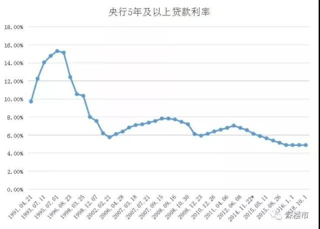
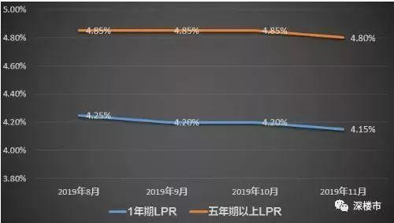
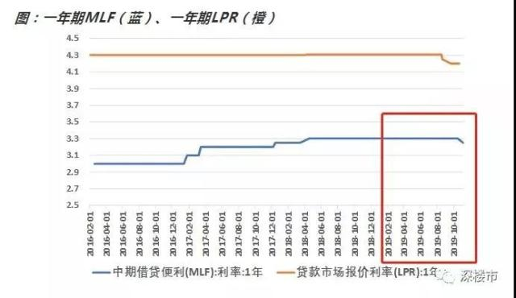

::: tip
为了让大家更快速了解每月最新LPR利率，以及LPR利率的变化趋势，每月20日会更新折线图数据。
:::

<pages-houseLPR />

### 贷款市场报价利率（LPR）简介
贷款市场报价利率（LPR）由各报价行按公开市场操作利率（主要指中期借贷便利利率）加点形成的方式报价，由全国银行间同业拆借中心计算得出，为银行贷款提供定价参考。目前，LPR包括1年期和5年期以上两个品种。

　　LPR报价行目前包括18家银行，每月20日（遇节假日顺延）9时前，各报价行以0.05个百分点为步长，向全国银行间同业拆借中心提交报价，全国银行间同业拆借中心按去掉最高和最低报价后算术平均，并向0.05%的整数倍就近取整计算得出LPR，于当日9时30分公布，公众可在全国银行间同业拆借中心和中国人民银行网站查询。
> 1年期是短期贷款参考的利率，5年期是5年以上的贷款参考利率

LPR改革后，LPR在上周正式迎来下调，房贷利率也跟随下调。

这对购房者来说，无疑是一个大利好，但很多人掏出计算器算了一波之后，却哭笑不得。

马克就是个典型的例子：

LPR的消息刚发布不久，他就扭过头来，激动地和我说：

“天啊，终于等来一个政策，我房子的月供可以减轻啦！”一边说着一边激动地敲着键盘，盘算具体的月供金额。

计算结果出来的那一刻，他长叹了一口气：“一百多万贷款月供只少了40多块，我该哭呢还是该笑呢...”

确实，**央行公布的5年期以上LPR为4.80%，相比上个月的4.85%仅下降5个基点**。这5个基点平摊到月供中，100万的月供仅少个30块，对购房者来说仅仅只是杯水车薪。

央行关于LPR下调的公告

但是，即便如此，我也劝马克更开心一点，甚至我也建议大家保持一个更乐观的预期。

为什么？

因为大家不要目光局限于单次的LPR下调，LPR每个月都会更新一次，**关键是接下来的趋势是什么？继续下调、平稳、还是回升？**

在这里，我先放结论：**未来一到两年内，LPR大概率还是会继续下调**，现在虽然只是少个30块，利率下行的趋势下，房贷减轻的可不仅仅这30块。

1

要解答利率为什么还会继续下调，我们得先搞清楚LPR的来龙去脉。

首先得要明确一点的是：

**在今年LPR改革之前，我们贷款买房，完全取决于央行基准利率**。并且，贷款合同上约定的贷款利率不是固定不变，会随着每年的基准利率的变动而变动。当然也有一些贷款合同约定的是固定利率，但这一般都很少见。

这里就涉及到了基准利率，基准利率一动，房贷利率也会跟着动。在今年10月LPR改革之前，基准利率为4.90%，已经维持了4年之久。那这个基准利率怎么来的呢？

**一句话来说，基准利率是由央行拍脑袋决定的**

央行基准利率（5年期以上）走势图

为什么我要说“拍脑袋”？

主要是因为在2013年利率改革之前，央行决定的基准利率并不完全由市场决定，很大程度上依赖于央行的主观判断。

其实按照国际经验，基准利率（每个国家叫法不同）是由市场上的借贷双方（主要是银行间市场）自由约定，然后综合各方算出来的一个综合利率。

这样才能真实反映市场的真实利率，而不是说让央行直接拍板。

所以，2013年央行启动了利率改革，LPR就是从那时开始正式诞生。

2

LPR全称Loan Prime Rate，意思就是贷款基础利率。综合市场上的借贷双方自由报价而呈现的利率，不再受央行管，更能够反映市场的真实利率水平。

**一句话来说，LPR根据市场各方自由报价确定，央行管不着。**

而当时很多银行尚未具备定价能力（只有10家银行参与LPR报价），还无法报出稳定的LPR报价，为了防止利率市场混乱，**LPR暂时以央行的基准利率为基准，仅作为一种过渡的措施。**

也就是说，尽管早在2013年就推出LPR改革，但这6年来，市场上的贷款利率还是以央行的基准利率为准，市场化程度并不高。

但如果LPR一直这么玩，那就和没改革差不多了。因为**LPR还只是在银行间市场中应用**，普通人贷款买房、买车、创业什么的，还是得要看基准利率，此LPR毫无存在感。

3

所以，今年8月，LPR再次迎来改革，一个最重要的变化就是：**LPR由原来的紧跟央行基准利率，转变为央行的公开操作市场利率。**

不是说自行商量确定的吗？怎么又多出来一个央行的公开操作市场利率呢？

别慌，这个利率是商业银行找央行借钱的利率，按照抵押品或者借款期限的不同，分为好几种，我们只需要记住最主流的一种，就是中期借贷便利（MLF）。

**现在基准就是以MLF利率为基础，加减点形成最终的LPR报价。**这些加减点完全取决于市场，而且，参与报价的银行由10家增加至18家，大大提高了LPR的市场化程度。

近4个月LPR走势

最为重要的是，LPR不再是局限于银行间市场，进一步扩展到银行住房抵押贷款市场，意味着我们普通人买房的贷款利率，直接与LPR挂钩。

**一言以蔽之，LPR=央行MLF利率+上下浮动点数，无需参考央行基准利率。**

4

明白了LPR的来龙去脉后，大致能够总结出以下几点：

**（1）基准利率成过去式，利率更低的LPR将是主流**

LPR和基准利率，一个是新兴市场化利率，一个过去行政化利率，相对比，显然前者更符合我们的特色社会道路。

**国家已经在LPR改革的道路上大阔前进，未来利率市场的主流一定是LPR，基准利率可能会退出历史舞台。**

更重要的是，代表市场利率的LPR，在今年的改革中，就已经用脚投出了低利率的“选票”：

不管是1年期LPR还是5年期以上LPR，8月改革之后，LPR明显走出了一个下调趋势。

**（2）决定LPR的MLF利率下调趋势更明显**

**房贷利率=LPR+上下浮动点数，而LPR=央行MLF利率+上下浮动点数。**

如果一定要究根结底，**房贷利率最终的锚就是央行MLF利率。**

而MLF利率，2019年开始出现明显的下调信号：

央行MLF利率走势（2016年至今）

所以，要判断每个月LPR走势，可以参考当月MLF走势，当MLF下调或上浮，LPR大概率会跟着一起下调或上浮。

**（3）当下的经济基本面不支持高利率**

前面我们看到，不管是LPR还是MLF，利率都是趋势下调，之所以下调，意味着市场对低利率的渴求。

而**市场一旦追逐低利率，往往也就意味着经济基本面的压力巨大**，低利率能够刺激借贷，最终达到刺激经济的效果。

我们现在的情形，正处于这样一种压力之下：大国贸易博弈，进出口波动显著；楼市降温，投资减弱；猪瘟影响，通胀飙升。**出口、投资、消费三驾马车压力与日俱增。**

**这种情形下，利率只能越来越低。**

所以，不管是LPR还是MLF，其背后都有着宏大的经济基本面影响。

**未来，将是一个长期性的下调过程**（如果你懒得看全文，这一句大概就是文章主旨了）。

最后，通过上述几点，也就不难解释我前面说的LPR大概率继续下调的结论。但需要提一点的是，别忘了房贷利率本身就有上浮的点数，也就是最终房贷利率是各地上浮和下调的结果，在楼市调控收紧下，即使LPR下调，上浮点数还会覆盖掉下调的部分，即整体房贷利率还是会保持稳定，不可能大幅松动。

总之，对于购房者来说，大可不用担心未来利率上调增加自己月供压力，因为下行的趋势是非常明显的。

同时，也不用因为月供只少个几十块而灰心，因为如果把目光放长远点，未来一两年，LPR还是会继续缓慢下调，对于存量房贷来说，月供压力或许大幅明显减轻！

况且，几十块钱，也是钱啊！