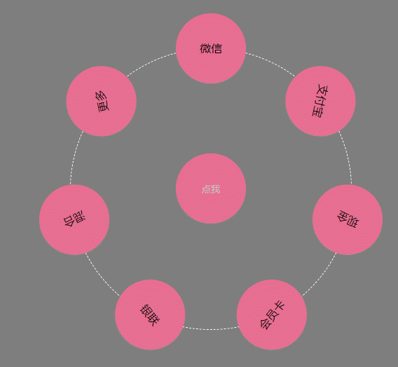

# 菊花布局动画
## 动画效果图

## js版本
```html
<!DOCTYPE html>
<html lang="en">
  <head>
    <meta charset="UTF-8" />
    <title>Title</title>
    <style>
      * {
        margin: 0;
        padding: 0;
      }
      #box {
        height: 800px;
        background: #7e7e7e;
        position: relative;
        overflow: hidden;
      }
      .item,
      .dashed {
        position: absolute;
        left: 50%;
        top: 100px;
        width: 400px;
        height: 400px;
      }
      .bot {
        text-align: center;
        line-height: 100px;
        border-radius: 50%;
        background: #e96f92;
        width: 100px;
        height: 100px;
        left: 50%;
        position: absolute;
      }

      .dashed {
        border-radius: 50%;
        transform: translateX(-50%);
        border: 1px dashed #ffffff;
      }
      .scale {
        transform: translate(50%, 250%) !important ;
        opacity: 0;
      }
      .click {
        width: 100px;
        height: 100px;
        background: #e96f92;
        border: 0;
        outline: 0;
        z-index: 2;
        color: silver;
        border-radius: 50%;
        position: absolute;
        left: 50%;
        transform: translateX(-50%);
        top: 250px;
      }
      .click:active {
        background: #0066ff;
      }
    </style>
  </head>
  <body>
    <!-- 使用绝对定位配合三角函数 https://blog.csdn.net/angularWQ/article/details/80540588-->
    <div id="box">
      <div class="dashed"></div>
      <button class="click">点我</button>
    </div>
    <script>
      let box = document.getElementById('box');
      for (let i = 0; i < 10; i++) {
        let item = document.createElement('div');
        item.className = 'item';
        item.style.transform = `translateX(-50%) rotate(${i * 36}deg)`;
        let bot = document.createElement('div');
        bot.className = 'bot scale';
        bot.style.transform = `translate(-50%,-50%) rotate(-${i * 36}deg)`;
        bot.innerHTML = `${i}`;
        // bot.style.transition= `all 0.3s linear ${i*0.3}s `;
        bot.style.transition = `all 0.3s linear  `;
        item.appendChild(bot);
        box.appendChild(item);
      }
      let button = document.querySelector('.click');
      button.onclick = function () {
        let itemAll = document.querySelectorAll('.bot');
        Array.from(itemAll, (item) => item.classList.toggle('scale'));
      };
    </script>
  </body>
</html>
```

## vue版本
```html
<!DOCTYPE html>
<html lang="en">
  <head>
    <meta charset="UTF-8" />
    <meta name="viewport" content="width=device-width, initial-scale=1.0" />
    <title>Document</title>
    <script src="https://cdn.jsdelivr.net/npm/vue/dist/vue.js"></script>
    <style>
      * {
        margin: 0;
        padding: 0;
      }
      #box {
        height: 800px;
        background: #7e7e7e;
        position: relative;
        overflow: hidden;
      }
      .item,
      .dashed {
        position: absolute;
        left: 50%;
        top: 100px;
        width: 400px;
        height: 400px;
      }
      .bot {
        text-align: center;
        line-height: 100px;
        border-radius: 50%;
        background: #e96f92;
        width: 100px;
        height: 100px;
        left: 50%;
        position: absolute;
      }
      .dashed {
        border-radius: 50%;
        transform: translateX(-50%);
        border: 1px dashed #ffffff;
      }
      .scale {
        transform: translate(50%, 250%) !important ;
        opacity: 0;
      }
      .click {
        width: 100px;
        height: 100px;
        background: #e96f92;
        border: 0;
        outline: 0;
        z-index: 2;
        color: silver;
        border-radius: 50%;
        position: absolute;
        left: 50%;
        transform: translateX(-50%);
        top: 250px;
      }
      .click:active {
        background: #0066ff;
      }
    </style>
  </head>
  <body>
    <div id="app">
      <div id="box">
        <div class="dashed"></div>
        <button class="click" @click="clickMe">点我</button>
        <div
          class="item"
          v-for="(item, i) in payment"
          :key="item.value"
          :style="`transform: translateX(-50%) rotate(${i * (360 / payment.length)}deg)`"
        >
          <div
            :class="['bot', flag ? '' : 'scale']"
            :style="`transform: translate(-50%,-50%) rotate(${i * (360 / payment.length)}deg); transition: all 0.3s linear`"
          >
            {{item.name}}
          </div>
        </div>
      </div>
    </div>

    <script>
      var app = new Vue({
        el: '#app',
        data: {
          flag: false,
          payment: [
            {
              name: '微信',
              value: 'wx',
            },
            {
              name: '支付宝',
              value: 'zfb',
            },
            {
              name: '现金',
              value: 'xj',
            },
            {
              name: '会员卡',
              value: 'hyk',
            },
            {
              name: '银联',
              value: 'yl',
            },
            {
              name: '混合',
              value: 'hh',
            },
            {
              name: '更多',
              value: 'gd',
            },
          ],
        },
        methods: {
          clickMe() {
            this.flag = !this.flag;
          }
        }
      });
    </script>
  </body>
</html>
```