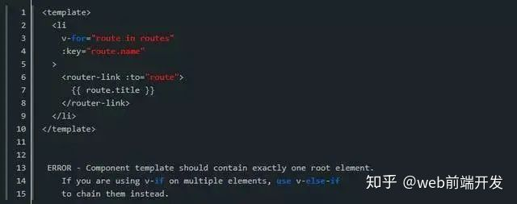

# vue使用优化及使用技巧

[[toc]]

### vue预渲染解决首页白屏和SEO (npm i prerender-spa-plugin)

```js
npm install prerender-spa-plugin
```
缺陷数据不够动态，可以使用ssr服务端渲染

```js
const PrerenderSPAPlugin = require('prerender-spa-plugin');
const path = require('path');
module.exports = {
    configureWebpack: {
        plugins: [
            new PrerenderSPAPlugin({
                staticDir: path.join(__dirname, 'dist'),
                routes: [ '/', '/about',],
            })
        ]
    }
  }
```

### 骨架屏加载 （npm i vue-skeleton-webpack-plugin）单页骨架屏   多页骨架屏（带路由）

配置webpack插件 vue-skeleton-webpack-plugin
1. 单页骨架屏幕
```js
import Vue from 'vue';
import Skeleton from './Skeleton.vue';
export default new Vue({
    components: {
        Skeleton:Skeleton
    },
    template: `
        <Skeleton></Skeleton>
    `});// 骨架屏
plugins: [
    new SkeletonWebpackPlugin({
        webpackConfig: {
            entry: {
                app: resolve('./src/entry-skeleton.js')
            }
        }
    })]
```
2. 带路由（多页）的骨架屏，编写skeleton.js文件

```js
import Vue from 'vue';
import Skeleton1 from './Skeleton1';
import Skeleton2 from './Skeleton2';
export default new Vue({
  components: {
      Skeleton1,
      Skeleton2
  },
  template: `
    <div>
      <skeleton1 id="skeleton1" style="display:none"/>
      <skeleton2 id="skeleton2" style="display:none"/>
    </div>`
});
```

```js
new SkeletonWebpackPlugin({
  webpackConfig: {
      entry: {
          app: path.join(__dirname, './src/skeleton.js'),
      },
  },
  router: {
    mode: 'history',
    routes: [
      {
        path: '/',
        skeletonId: 'skeleton1'
      },
      {
        path: '/about',
        skeletonId: 'skeleton2'
      },
    ]
  },
  minimize: true,
  quiet: true,
})
```
### 优化技巧

* 服务端渲染（ssr）nuxt.js

* webpack优化
  1. 使用cdn 配合 externals配置

  2. 使用多线程打包happypack   

  3. 提取公共模块webpack4---splitsChunks (webpack3用的是CommonsChunkPlugin插件)

  4. sourceMap配置

  > 配合使用webpack-bundle-analyzer分析打包后文件大小

* data属性之定义响应式数据

* spa页面使用keep-alive缓存组件

* 拆分组件: vue组件渲染是具体到组件的，如果组件拆分够细，那么数据变动，页面渲染也就具体到某一个组件

* v-if 具有阻断功能  尽量使用v-if 简单的显示隐藏就使用v-show

* key保持唯一性  尽量不要使用 索引做

* 海量数据展示时，不需要响应，那么就使用Object.freeze去冻结，不去添加响应式 Object.defineProperty

* 路由懒加载和异步加载

* 尽量使用runtime运行时   （即.vue文件形式（webpack打包时进行编译）   而不是在vue实列里面写template模板(代码运行时进行编译，此时消耗性能)）

* 数据持久化
    1. 页面刷新重新请求接口
    1. 存入本地localstroage sessionstroage
    >（使用插件：npm i vue-persist）

### 化繁为简的Watch

::: tip 场景还原
组件创建的时候我们获取一次列表，同时监听input框，每当发生变化的时候重新获取一次筛选后的列表这个场景很常见，有没有办法优化一下呢？
:::

```js
created: {
  this.getList()
},
watch: {
  searchInputValue() {
    this.getList()
  }
}
```

> 优化后

首先，在watch中，可以直接使用函数的字面量名称；其次，声明immediate:true表示创建组件时立马执行一次。

```js
watch: {
  searchInputValue: {
    handler: 'getList',
    immediate:true
  }
}
```

### 一劳永逸的组件注册

::: tip 场景还原
我们写了一堆基础UI组件，然后每次我们需要使用这些组件的时候，都得先import，然后声明components，很繁琐！秉持能偷懒就偷懒的原则，我们要想办法优化！
:::

> 优化后

::: tip 注意
我们需要借助一下神器webpack，使用 require.context() 方法来创建自己的（模块）上下文，从而实现自动动态require组件。这个方法需要3个参数：要搜索的文件夹目录，是否还应该搜索它的子目录，以及一个匹配文件的正则表达式。
:::

我们在components文件夹添加一个叫global.js的文件，在这个文件里借助webpack动态将需要的基础组件统统打包进来。

```js
import Vue from 'vue'
function capitalizeFirstLetter(string) {
  return string.chartAt(0).toUpperCase() + string.slice(1)
}
//找到components文件夹下.vue文件
const requireComponent = require.context('.', false, /\.vue$/)
requireComponent.keys()forEach(filename => {
  // 组件实例
  const componentConfig = requireComponents(filename)
  // 组件名字
  const componentName = capitalizeFirstLetter(
    // 因为得到的filename格式是： ‘./baseButton.vue’, 所以这里我们去掉头和尾部，只保留真正的文件名
    filename.replace(/^\.\//, '').replace(/\.\w+$/, '')
  )
  // 组件挂载
  Vue.component(componentName, componentConfig.default || componentConfig)
})
```

最后我们在main.js中import 'components/global.js'，然后我们就可以随时随地使用这些基础组件，无需手动引入了。


### 无所不能的render函数

::: tip 场景还原
vue要求每一个组件都只能有一个根元素，当你有多个根元素时，vue就会给你报错
:::



> 那有没有办法化解呢，答案是有的，只不过这时候我们需要使用render()函数来创建HTML，而不是template。其实用js来生成html的好处就是极度的灵活功能强大，而且你不需要去学习使用vue的那些功能有限的指令API，比如v-for, v-if。（reactjs就完全丢弃了template）

```js
functional: true
render(h, { props }) {
  return props.routes.map(route => {
    <li key={route.name}>
      <router-link to={route}>
        {route.title}
      </router-link>
    </li>
  })
}
```


### 无招胜有招的高阶组件

::: tip 场景还原
划重点：这一招威力无穷，请务必掌握
:::

>当我们写组件的时候，父子组件的通信很重要。通常我们都需要从父组件传递一系列的props到子组件，同时父组件监听子组件emit过来的一系列事件。举例子：


```js
// 父组件
<BaseInput
  :value="value"
  label="密码"
  placeholder="请填写密码"
  @input="handleInput"
  @focus="handleFocus"
>
</BaseInput>
// 子组件
<template>
  <label>
    {{ label }}
    <input
      :value="value"
      :placeholder="placeholder"
      @input="$emit('input', $event)"
      @focus="$emit('focus', $event.target.value)"
    />
  </label>
</template>
```


有下面几个优化点：

每一个从父组件传到子组件的props,我们都得在子组件的Props中显式的声明才能使用。这样一来，我们的子组件每次都需要申明一大堆props, 而类似placeholer这种dom原生的property我们其实完全可以直接从父传到子，无需声明。方法如下

```js
<input
  :value="value"
  v-bind="$attrs"
  @input="$emit('input', $event)"
/>
```

::: tip 注意
$attrs包含了父作用域中不作为 prop 被识别 (且获取) 的特性绑定 (class 和 style 除外)。当一个组件没有声明任何 prop 时，这里会包含所有父作用域的绑定，并且可以通过v-bind="$attrs" 传入内部组件——在创建更高层次的组件时非常有用。注意到子组件的@focus=$emit('focus', $event)"其实什么都没做，只是把event传回给父组件而已，那其实和上面类似，我完全没必要显式地申明：
:::

```js
<input
  :value="value"
  v-bind="$attrs"
  v-on="listeners"
/>

computed: {
  listeners() {
    return {
      ...this.$listeners,
      input: (e) => {
        this.$emit('input', e.target.value)
      }
    }
  }
}
```

::: tip 注意
$listeners包含了父作用域中的 (不含 .native 修饰器的) v-on 事件监听器。
它可以通过 v-on="$listeners" 传入内部组件——在创建更高层次的组件时非常有用。
:::

::: warning 警告
需要注意的是，由于我们input并不是BaseInput这个组件的根节点，而默认情况下父作用域的不被认作 props 的特性绑定将会“回退”且作为普通的 HTML 特性应用在子组件的根元素上。所以我们需要设置inheritAttrs:false，这些默认行为将会被去掉, 以上两点的优化才能成功。
:::